# GitHub Lead Generation System - Executive Summary

## Deep.BI | Apache Druid Solutions Provider

---

## Executive Summary

This document outlines an automated lead generation system that identifies potential customers from the Apache Druid GitHub repository community. The system extracts, enriches, and scores leads to help Deep.BI's sales team prioritize outreach to the most promising prospects.

---

## System Overview

```mermaid
flowchart TB
    subgraph Input["📥 Data Sources"]
        GH[("🐙 GitHub API<br/>Apache Druid Repo")]
        LI[("💼 LinkedIn")]
        TW[("🐦 Twitter/X")]
        CO[("🏢 Company Data<br/>Clearbit/Crunchbase")]
    end

    subgraph Process["⚙️ n8n Workflow Engine"]
        direction TB
        COLLECT["1️⃣ Collect GitHub Users<br/>Stargazers • Watchers • Issue Creators"]
        DELTA["2️⃣ Delta Detection<br/>Identify New Leads"]
        ENRICH["3️⃣ Profile Enrichment<br/>Social • LinkedIn • Company"]
        ANALYZE["4️⃣ Keyword Analysis<br/>druid • flink • starrocks"]
        SCORE["5️⃣ Lead Scoring<br/>Composite Score 0-100"]
        RECOMMEND["6️⃣ Outreach Recommendations<br/>Channel • Talking Points • Urgency"]
    end

    subgraph Output["📤 Outputs"]
        DB[("📊 Lead Database<br/>Google Sheets/Airtable")]
        REPORT["📈 Summary Reports"]
        ALERTS["🔔 Notifications"]
    end

    GH --> COLLECT
    COLLECT --> DELTA
    DELTA --> ENRICH
    LI --> ENRICH
    TW --> ENRICH
    CO --> ENRICH
    ENRICH --> ANALYZE
    ANALYZE --> SCORE
    SCORE --> RECOMMEND
    RECOMMEND --> DB
    RECOMMEND --> REPORT
    RECOMMEND --> ALERTS
```

---

## User Journey: From GitHub Activity to Qualified Lead

### Visual Flow

```mermaid
flowchart TD
    subgraph PHASE1["🎯 PHASE 1: GitHub Activity"]
        direction LR
        A1["⭐ Stars Repo"]
        A2["👁️ Watches Repo"]
        A3["🐛 Creates Issue"]
    end

    subgraph PHASE2["🔄 PHASE 2: Data Collection"]
        direction LR
        B1["📥 Extract Profile"]
        B2["🆕 Detect if New"]
    end

    subgraph PHASE3["🔍 PHASE 3: Enrichment"]
        direction LR
        C1["💼 Find LinkedIn"]
        C2["🏢 Get Company Info"]
        C3["🔑 Analyze Keywords"]
    end

    subgraph PHASE4["📊 PHASE 4: Qualification"]
        direction LR
        D1["🧮 Calculate Score"]
        D2["🏷️ Assign Tier"]
        D3["💡 Generate Recommendations"]
    end

    subgraph PHASE5["🚀 PHASE 5: Sales Action"]
        direction LR
        E1["📋 Review Leads"]
        E2["📧 Personalized Outreach"]
        E3["🤝 Create Opportunity"]
    end

    A1 --> B1
    A2 --> B1
    A3 --> B1
    B1 --> B2
    B2 --> C1
    C1 --> C2
    C2 --> C3
    C3 --> D1
    D1 --> D2
    D2 --> D3
    D3 --> E1
    E1 --> E2
    E2 --> E3

    style PHASE1 fill:#e8f5e9,stroke:#4caf50,stroke-width:2px
    style PHASE2 fill:#e3f2fd,stroke:#2196f3,stroke-width:2px
    style PHASE3 fill:#fff3e0,stroke:#ff9800,stroke-width:2px
    style PHASE4 fill:#fce4ec,stroke:#e91e63,stroke-width:2px
    style PHASE5 fill:#f3e5f5,stroke:#9c27b0,stroke-width:2px
```

### Detailed Journey Steps

| Phase | Step | Actor | Description | Output |
|-------|------|-------|-------------|--------|
| **1. GitHub Activity** | ⭐ Star | User | User discovers and stars Apache Druid repo | GitHub event |
| | 👁️ Watch | User | User subscribes to repo notifications | GitHub event |
| | 🐛 Issue | User | User creates issue (bug, feature, question) | GitHub event + context |
| **2. Collection** | 📥 Extract | n8n | Pull user profile from GitHub API | Raw profile data |
| | 🆕 Delta | n8n | Compare against previous run | `is_new` flag |
| **3. Enrichment** | 💼 LinkedIn | n8n | Find and extract LinkedIn profile | Title, company, history |
| | 🏢 Company | n8n | Gather company intelligence | Size, team, budget tier |
| | 🔑 Keywords | n8n | Scan for relevant keywords | Keyword score |
| **4. Qualification** | 🧮 Score | n8n | Calculate composite score (0-100) | Lead score |
| | 🏷️ Tier | n8n | Assign Hot/Warm/Cold tier | Priority level |
| | 💡 Recommend | n8n | Generate outreach strategy | Talking points, channel |
| **5. Sales** | 📋 Review | Sales | Review qualified leads in dashboard | Prioritized list |
| | 📧 Outreach | Sales | Send personalized message | Initial contact |
| | 🤝 Opportunity | Sales | Convert to sales opportunity | Pipeline entry |

### Conversion Funnel

```mermaid
flowchart TB
    subgraph Funnel["Lead Conversion Funnel"]
        F1["👥 15,000+ GitHub Users<br/>(Stargazers + Watchers + Issue Creators)"]
        F2["📊 ~12,000 with Profiles<br/>(80% data completeness)"]
        F3["💼 ~6,000 with LinkedIn<br/>(50% enriched)"]
        F4["🔥 ~1,500 Hot Leads<br/>(Score > 70)"]
        F5["🤝 ~150 Opportunities<br/>(10% conversion)"]
        F6["💰 ~30 Deals<br/>(20% close rate)"]
    end

    F1 --> F2
    F2 --> F3
    F3 --> F4
    F4 --> F5
    F5 --> F6

    style F1 fill:#e3f2fd,stroke:#1976d2
    style F2 fill:#e8f5e9,stroke:#388e3c
    style F3 fill:#fff8e1,stroke:#ffa000
    style F4 fill:#ffebee,stroke:#d32f2f
    style F5 fill:#f3e5f5,stroke:#7b1fa2
    style F6 fill:#e8f5e9,stroke:#2e7d32,stroke-width:3px
```

---

## n8n Workflow Architecture

```mermaid
flowchart LR
    subgraph Trigger["🚀 Triggers"]
        SCHED["⏰ Scheduled<br/>(Daily/Weekly)"]
        MANUAL["👆 Manual<br/>On-Demand"]
    end

    subgraph Main["🎯 Main Orchestrator"]
        START["Start"] --> W1
        W1["GitHub Collection<br/>Sub-workflow"] --> W2
        W2["Delta Detection<br/>Sub-workflow"] --> W3
        W3["Social Enrichment<br/>Sub-workflow"] --> W4
        W4["Analysis & Scoring<br/>Sub-workflow"] --> W5
        W5["Output Generation<br/>Sub-workflow"] --> END["Complete"]
    end

    SCHED --> START
    MANUAL --> START
```

---

## Data Collection Pipeline

```mermaid
flowchart TB
    subgraph GitHub["GitHub Data Collection"]
        API["GitHub API"] --> STARS["Get Stargazers<br/>~13,000+ users"]
        API --> WATCH["Get Watchers<br/>~500+ users"]
        API --> ISSUES["Get Issue Creators<br/>~2,000+ users"]
        
        STARS --> MERGE["Merge & Deduplicate"]
        WATCH --> MERGE
        ISSUES --> MERGE
        
        MERGE --> PROFILE["Enrich Profiles<br/>Name • Bio • Company • Email"]
    end

    subgraph Delta["Delta Detection"]
        PROFILE --> COMPARE["Compare with<br/>Previous Run"]
        STORE[("Previous<br/>User IDs")] --> COMPARE
        COMPARE --> FLAG["Flag New Leads<br/>is_new = true"]
        FLAG --> UPDATE["Update Storage"]
        UPDATE --> STORE
    end

    FLAG --> OUTPUT["To Enrichment"]
```

---

## Lead Scoring Algorithm

### Scoring Factors

| Factor | Weight | Description |
|--------|--------|-------------|
| **Keyword Relevance** | 25% | Presence of keywords: druid, flink, starrocks, data engineering, real-time analytics |
| **Job Title** | 20% | Relevance of current role: Data Engineer, Analytics Engineer, CTO, VP Engineering |
| **Company Potential** | 20% | Company size and data team composition |
| **Engagement Level** | 20% | Issue Creator (100) > Watcher (70) > Stargazer (40) |
| **Recency** | 15% | How recently the user engaged with the repo |

### Lead Tiers

| Tier | Score Range | Action |
|------|-------------|--------|
| 🔥 **Hot** | 70-100 | Immediate outreach priority |
| 🌡️ **Warm** | 40-69 | Schedule follow-up |
| ❄️ **Cold** | 0-39 | Nurture campaign |

---

## Company Intelligence

### Company Size Categories

| Category | Employee Count | Budget Tier |
|----------|---------------|-------------|
| Startup | 1-50 | Low |
| Small | 51-200 | Medium |
| Medium | 201-1,000 | High |
| Large | 1,001-5,000 | High |
| Enterprise | 5,000+ | Enterprise |

---

*Deep.BI Lead Generation Initiative | January 2026*
