# GitHub Lead Generation System for Deep.BI

## Executive Summary

This document outlines an automated lead generation system that identifies potential customers from the Apache Druid GitHub repository community. The system extracts, enriches, and scores leads to help Deep.BI's sales team prioritize outreach to the most promising prospects.

---

## System Overview

```mermaid
flowchart TB
    subgraph Input["📥 Data Sources"]
        GH[("🐙 GitHub API<br/>Apache Druid Repo")]
        LI[("💼 LinkedIn")]
        TW[("🐦 Twitter/X")]
        CO[("🏢 Company Data<br/>Clearbit/Crunchbase")]
    end

    subgraph Process["⚙️ n8n Workflow Engine"]
        direction TB
        COLLECT["1️⃣ Collect GitHub Users<br/>Stargazers • Watchers • Issue Creators"]
        DELTA["2️⃣ Delta Detection<br/>Identify New Leads"]
        ENRICH["3️⃣ Profile Enrichment<br/>Social • LinkedIn • Company"]
        ANALYZE["4️⃣ Keyword Analysis<br/>druid • flink • starrocks"]
        SCORE["5️⃣ Lead Scoring<br/>Composite Score 0-100"]
        RECOMMEND["6️⃣ Outreach Recommendations<br/>Channel • Talking Points • Urgency"]
    end

    subgraph Output["📤 Outputs"]
        DB[("📊 Lead Database<br/>Google Sheets/Airtable")]
        REPORT["📈 Summary Reports"]
        ALERTS["🔔 Notifications"]
    end

    GH --> COLLECT
    COLLECT --> DELTA
    DELTA --> ENRICH
    LI --> ENRICH
    TW --> ENRICH
    CO --> ENRICH
    ENRICH --> ANALYZE
    ANALYZE --> SCORE
    SCORE --> RECOMMEND
    RECOMMEND --> DB
    RECOMMEND --> REPORT
    RECOMMEND --> ALERTS
```

---

## User Journey: From GitHub Activity to Qualified Lead

---

## n8n Workflow Architecture

```mermaid
flowchart LR
    subgraph Trigger["🚀 Triggers"]
        SCHED["⏰ Scheduled<br/>(Daily/Weekly)"]
        MANUAL["👆 Manual<br/>On-Demand"]
    end

    subgraph Main["🎯 Main Orchestrator"]
        START["Start"] --> W1
        W1["GitHub Collection<br/>Sub-workflow"] --> W2
        W2["Delta Detection<br/>Sub-workflow"] --> W3
        W3["Social Enrichment<br/>Sub-workflow"] --> W4
        W4["Analysis & Scoring<br/>Sub-workflow"] --> W5
        W5["Output Generation<br/>Sub-workflow"] --> END["Complete"]
    end

    SCHED --> START
    MANUAL --> START
```

---

## Data Collection Pipeline

```mermaid
flowchart TB
    subgraph GitHub["GitHub Data Collection"]
        API["GitHub API"] --> STARS["Get Stargazers<br/>~13,000+ users"]
        API --> WATCH["Get Watchers<br/>~500+ users"]
        API --> ISSUES["Get Issue Creators<br/>~2,000+ users"]
        
        STARS --> MERGE["Merge & Deduplicate"]
        WATCH --> MERGE
        ISSUES --> MERGE
        
        MERGE --> PROFILE["Enrich Profiles<br/>Name • Bio • Company • Email"]
    end

    subgraph Delta["Delta Detection"]
        PROFILE --> COMPARE["Compare with<br/>Previous Run"]
        STORE[("Previous<br/>User IDs")] --> COMPARE
        COMPARE --> FLAG["Flag New Leads<br/>is_new = true"]
        FLAG --> UPDATE["Update Storage"]
        UPDATE --> STORE
    end

    FLAG --> OUTPUT["To Enrichment"]
```

---

## Lead Scoring Algorithm

### Scoring Factors

| Factor | Weight | Description |
|--------|--------|-------------|
| **Keyword Relevance** | 25% | Presence of keywords: druid, flink, starrocks, data engineering, real-time analytics |
| **Job Title** | 20% | Relevance of current role: Data Engineer, Analytics Engineer, CTO, VP Engineering |
| **Company Potential** | 20% | Company size and data team composition |
| **Engagement Level** | 20% | Issue Creator (100) > Watcher (70) > Stargazer (40) |
| **Recency** | 15% | How recently the user engaged with the repo |

### Lead Tiers

| Tier | Score Range | Action |
|------|-------------|--------|
| 🔥 **Hot** | 70-100 | Immediate outreach priority |
| 🌡️ **Warm** | 40-69 | Schedule follow-up |
| ❄️ **Cold** | 0-39 | Nurture campaign |

---

## Keyword Analysis

```mermaid
flowchart LR
    subgraph Sources["Profile Sources"]
        BIO["GitHub Bio"]
        TITLE["Job Title"]
        HEAD["LinkedIn Headline"]
        SUMMARY["LinkedIn Summary"]
        HISTORY["Work History"]
    end

    subgraph Keywords["Keyword Tiers"]
        HIGH["🔴 High Relevance<br/>druid, apache druid"]
        MED["🟡 Medium Relevance<br/>flink, starrocks, clickhouse<br/>real-time analytics"]
        STD["🟢 Standard Relevance<br/>data engineering, OLAP<br/>data warehouse, big data"]
    end

    subgraph Scoring["Location Weights"]
        W1["Job Title: 3.0x"]
        W2["Headline: 2.5x"]
        W3["Company: 2.0x"]
        W4["Bio: 1.5x"]
        W5["Summary: 1.0x"]
        W6["Work History: 0.5x"]
    end

    Sources --> Keywords
    Keywords --> Scoring
    Scoring --> FINAL["Final Keyword Score<br/>(0-100)"]
```

---

## Company Intelligence

### Company Size Categories

| Category | Employee Count | Budget Tier |
|----------|---------------|-------------|
| Startup | 1-50 | Low |
| Small | 51-200 | Medium |
| Medium | 201-1,000 | High |
| Large | 1,001-5,000 | High |
| Enterprise | 5,000+ | Enterprise |

---

## Output: Lead Record Structure

---

## Error Handling & Recovery

---

## Implementation Phases

---

## Expected Outcomes

| Metric | Expected Value |
|--------|---------------|
| **Total Leads Collected** | ~15,000+ unique users |
| **New Leads per Run** | ~50-200 (depending on frequency) |
| **Hot Leads** | ~5-10% of total |
| **Warm Leads** | ~20-30% of total |
| **Data Completeness** | ~60-80% average |
| **Processing Time** | ~2-4 hours per full run |

---

## Next Steps

1. **Review this overview** - Ensure the approach aligns with Deep.BI's sales strategy
2. **Set up n8n instance** - Self-hosted or cloud
3. **Configure API credentials** - GitHub token, enrichment APIs
4. **Start implementation** - Follow tasks in `.kiro/specs/github-lead-generation-n8n/tasks.md`
5. **Test with smaller repo** - Validate before running against Apache Druid

---

*Generated for Deep.BI Lead Generation Initiative*
